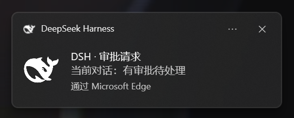

# dsh-notify-me

简体中文 | [English](README.en.md)

[](https://www.npmjs.com/package/dsh-notify-me)
[](https://www.npmjs.com/package/dsh-notify-me)


---

**离开 DSH 页面也不错过任何动静。** 当模型停下来需要你操作、或你在别的软件时回复正好完成，dsh-notify-me 会用系统通知 + 提示音 + 标签页标题标记提醒你。

---

## 效果预览

| Windows 系统通知效果 |
| --- |
|  |

[更新日志](CHANGELOG.md)

## 提醒时机

| 时机 | 提醒内容 | 默认 |
| --- | --- | --- |
| 🔔 **模型需要你操作** — 审批请求 / 方案待确认（plan review）/ 提问（`ask_user_question`） | 通知 + 提示音 + `🔔 需要你 ·` 标题标记 | 页面可见也提醒 |
| ✅ **回复完成** — 一轮回复跑完；后台会话完成也会报 | 通知 + 提示音 | 仅页面隐藏/后台时提醒 |

## 提醒方式

- **系统通知**：Windows 通知中心 Toast（点击可把 DSH 窗口切回前台）
- **提示音**：WebAudio 合成音（"需要你"与"完成"使用不同音型）
- **标签页标题标记**：有待处理事项时，标题前出现 `🔔 需要你 · …`

本插件是**浏览器层**实现：DSH 页面需保持打开（最小化/后台即可——那正是它监听的"离开"状态）。

## 安装

```powershell
# DSH 官方插件命令：安装并自动挂载进 web profile
dsh plugin --profile web add dsh-notify-me
```

重启 `dsh web` 后硬刷新页面（Ctrl+Shift+R）。

**验证** — F12 控制台执行：

```js
window.__dshNotifyMe.test("done")        // "完成"示例
window.__dshNotifyMe.test("attention")   // "需要你"示例
```

没反应？九成是：通知权限被拒绝（在页面上点一下 → 选"允许"；或地址栏锁 → 站点设置 → 通知 → 允许 → 刷新）、装完没重启 DSH、系统设置里浏览器通知被关。

## 配置

偏好存 `localStorage`，在 F12 控制台实时调整：

```js
window.__dshNotifyMe.config                       // 查看
window.__dshNotifyMe.setConfig({
  attentionHiddenOnly: false, // true = 页面可见时"需要你"不提醒
  doneHiddenOnly: true,       // false = 页面可见时"完成"也提醒
  toast: true,                // 系统通知开关
  sound: true,                // 提示音开关
  volume: 0.5,                // 音量 0~1
  autoFocus: true             // 点通知切回 DSH 窗口
})
window.__dshNotifyMe.resetConfig()                // 恢复默认
```

## 工作原理

浏览器半身订阅客户端 `sessions` 服务（与 UI 同一数据源）：

- **当前会话** `ConversationSnapshot`：`running` true→false = 回复完成；`pending[]` 新增 `approval` / `plan-review` / `question` = 模型在等你（可行时在提醒里展示提问/审批内容）；
- **其它已列会话**摘要：出现新 `pendingInteraction`，或 `completed` 边沿（非选中状态下跑完）→ 后台工作提醒。

无 React/UI、无 settings 命名空间依赖、无第三方运行时依赖——提醒代码完全自包含、可审计。

## 已知限制

- 页面必须开着才会提醒（后台标签/最小化可以；关标签页即失效——浏览器层方案固有限制）。
- 通知经由浏览器弹出，需允许浏览器通知权限，且勿扰模式不能屏蔽它。
- 每次页面加载后第一次出声/弹通知前，需在页面上点击过一次（浏览器自动播放与权限策略）。
- 未授权通知权限时只有提示音与标题标记。

## 开发自检

```powershell
node --check lib\client.js
node --check lib\index.js
node smoke\smoke-test.cjs     # 离线状态机冒烟测试
npm pack --dry-run            # 预览发布包（6 个文件，~10 kB）
```

## License

MIT — 见 [LICENSE](LICENSE)。
